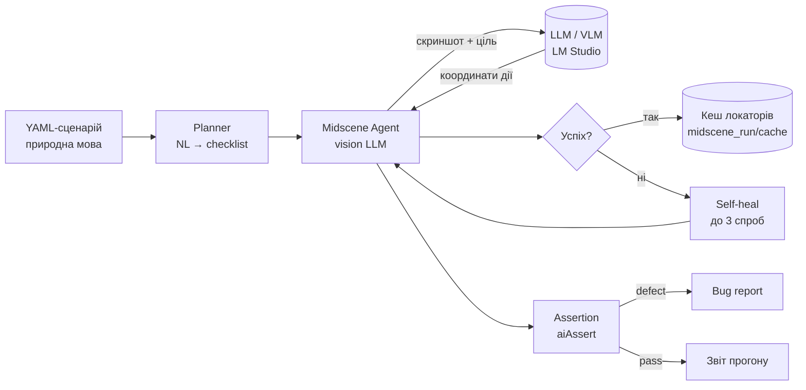

# Jules AI QA

Локальна автономна система забезпечення якості (QA) на базі **Playwright + Midscene.js + Stagehand**. Тести описуються природною мовою (українською), а AI-агент із комп'ютерним зором сам знаходить елементи на сторінці, виконує дії та перевіряє результат. Локатори кешуються, тож повторні прогони працюють швидко й майже без звернень до LLM.

Керування — через **веб-дашборд** у браузері: цілі (URL), сценарії, набори, прогони, логи в реальному часі, помилки та звіти. Усе працює локально (LM Studio / Ollama / vLLM) для приватності даних.

---

## Зміст

1. [Як це працює (архітектура)](#як-це-працює-архітектура)
2. [Встановлення та запуск](#встановлення-та-запуск)
3. [Веб-дашборд: огляд сторінок](#веб-дашборд-огляд-сторінок)
4. [Налаштування](#налаштування)
5. [Сценарії: структура та нюанси](#сценарії-структура-та-нюанси)
6. [Набори сценаріїв (suites)](#набори-сценаріїв-suites)
7. [Прогони (runs) та режими](#прогони-runs-та-режими)
8. [AI Лабораторія](#ai-лабораторія)
9. [Автентифікація та секрети](#автентифікація-та-секрети)
10. [Human-in-the-loop (пауза для оператора)](#human-in-the-loop-пауза-для-оператора)
11. [Звіти та артефакти](#звіти-та-артефакти)
12. [CLI та Docker](#cli-та-docker)
13. [Рекомендації та найкращі практики](#рекомендації-та-найкращі-практики)
14. [Усунення несправностей](#усунення-несправностей)

---

## Як це працює (архітектура)

Система складається з трьох рівнів:

| Рівень | Що робить | Технологія |
|--------|-----------|------------|
| **Дашборд (UI)** | Веб-інтерфейс QA-інженера | React + Vite (`web/`) |
| **Сервер (API)** | REST + SSE, оркестрація прогонів, сховище | Express (`src/server/`) |
| **Движок (Engine)** | Виконання кроків браузером під керуванням AI | Playwright + Midscene + Stagehand (`src/engine/`) |

Логіка одного кроку:



- **Planner** перетворює мету (`goal`) і кроки сценарію на машинний чекліст (`src/planning/`).
- **Midscene Agent** робить скриншот, надсилає його VLM-моделі, отримує дію (клік/ввід/прокрутка) і виконує її через Playwright.
- **Self-healing**: якщо крок впав (зсув локатора, таймаут, збій моделі) — до 3 повторних спроб із повторним аналізом свіжого скриншоту (`src/engine/self-heal.ts`).
- **Кеш локаторів** записується у `warm-up` і використовується у `regression`, щоб не викликати LLM на кожному кроці.
- **Stagehand** — гібридний рушій для складної AI-навігації (`navigation.type: ai`).

### Вимоги

- **Node.js 20+**
- **Chromium** (ставиться через Playwright)
- **LLM endpoint** з підтримкою vision: LM Studio (рекомендовано), Ollama, vLLM або хмара

---

## Встановлення та запуск

### Варіант 1: Docker (одна команда)

```bash
cp .env.lmstudio.example .env   # відредагуйте під свій LLM
docker compose up --build -d
```

Дашборд: **http://localhost:3840**

### Варіант 2: Локально без Docker

```bash
cp .env.example .env
npm install
npx playwright install chromium

npm run ui:build    # збірка фронтенду (один раз)
npm run start       # сервер + UI на http://localhost:3840
```

> **Windows / корпоративний SSL:** якщо `npm install` або `playwright install` падають з `UNABLE_TO_VERIFY_LEAF_SIGNATURE`:
> PowerShell: `$env:NODE_OPTIONS="--use-system-ca"`, потім повторіть команду.

---

## Веб-дашборд: огляд сторінок

| Сторінка | Призначення |
|----------|-------------|
| **Огляд** | Зведена статистика: pass rate, прогони за 7 днів, останні запуски |
| **Запуск тестів** | Конфігурація та старт прогону: один сценарій або набір |
| **Прогони** | Історія всіх прогонів зі статусами |
| **Деталі прогону** | Live-логи (SSE), результати по кроках, помилки, кнопки Скасувати/Продовжити, посилання на звіти |
| **Сценарії** | Список, створення, редагування YAML-сценаріїв |
| **Набори** | Групування сценаріїв у послідовності (suites) |
| **AI Лабораторія** | Генерація сценаріїв з опису природною мовою + ідеї тестів |
| **Налаштування** | Defaults, статус LLM, діагностика кешу |

У боковій панелі завжди видно **статус AI** (підключено / недоступно) і назву активної моделі.

---

## Налаштування

Є два рівні конфігурації:

### 1. `data/settings.json` — налаштування UI (defaults дашборду)

Редагується на сторінці **Налаштування** або напряму. Зберігаються між перезапусками.

| Поле | Опис |
|------|------|
| `qaTargetUrl` | URL сайту під тест за замовчуванням |
| `qaMode` | `warm-up` або `regression` |
| `qaScenarioPath` | Сценарій за замовчуванням |
| `debugCache` | Увімкнути `DEBUG=midscene:cache:*` (діагностика кешу локаторів) |
| `llmBaseUrl` | Базовий URL LLM (для перевірки статусу в UI) |
| `llmModelName` | Назва моделі для відображення |

> Значення з форми **Запуск** перекривають defaults лише для конкретного прогону.

### 2. `.env` — конфігурація движка та LLM

Скопіюйте шаблон: `cp .env.lmstudio.example .env` (LM Studio через Tailscale) або `cp .env.example .env`.

**Модель для виконання (Midscene, vision):**

| Змінна | Приклад | Опис |
|--------|---------|------|
| `MIDSCENE_MODEL_BASE_URL` | `https://macstudio.tailXXXX.ts.net/v1` | OpenAI-сумісний endpoint (без `/chat/completions`) |
| `MIDSCENE_MODEL_API_KEY` | `lm-studio` | Ключ (для LM Studio будь-який непорожній) |
| `MIDSCENE_MODEL_NAME` | `qwen3.6-35b-a3b-...` | API Identifier моделі з LM Studio |
| `MIDSCENE_MODEL_FAMILY` | `qwen3-vl` | Родина: `qwen2.5-vl` / `qwen3-vl` / `vlm-ui-tars` |
| `MIDSCENE_MODEL_TIMEOUT` | `600000` | Таймаут inference, мс (через Tailscale ставте більше) |
| `MIDSCENE_PREFERRED_LANGUAGE` | `Ukrainian` | Мова міркувань моделі |

**Planner (планувальник) і Critic (рецензент):** можуть вказувати на ту саму модель.

| Змінна | Опис |
|--------|------|
| `PLANNER_MODEL_BASE_URL` / `_NAME` / `_API_KEY` | Модель для планування та AI Лабораторії |
| `CRITIC_MODEL_BASE_URL` / `_NAME` / `_API_KEY` | Модель для критичного рев'ю згенерованих сценаріїв |

**Поведінка прогону:**

| Змінна | За замовч. | Опис |
|--------|-----------|------|
| `QA_TARGET_URL` | `https://example.com` | URL цілі (для CLI) |
| `QA_MODE` | `warm-up` | Режим (для CLI) |
| `QA_SCENARIO_PATH` | `scenarios/invalid-password.yaml` | Шлях до сценарію (для CLI) |
| `QA_HEADED` | `false` | Показувати браузер (автоматично `true` для auth/human-кроків) |
| `QA_HITL_TIMEOUT_MS` | `600000` | Скільки чекати оператора на паузі (10 хв) |
| `QA_STEP_TIMEOUT_MS` | `120000` | Бюджет часу на один крок |
| `MIDSCENE_REPLANNING_CYCLE_LIMIT` | `30` | Ліміт циклів переплановування Midscene |

**Технічні нюанси LM Studio / Tailscale:**

| Змінна | За замовч. | Опис |
|--------|-----------|------|
| `LMSTUDIO_PROXY_ENABLED` | `true` | Локальний проксі, що конвертує webp→png зображення для LM Studio |
| `LMSTUDIO_PROXY_PORT` | `3941` | Порт проксі |
| `LMSTUDIO_DISABLE_THINKING` | `true` | Вимкнути «thinking» Qwen (інакше модель може повертати порожню відповідь) |
| `ALLOW_INSECURE_TLS` | `true` | Дозволити самопідписаний сертифікат (безпечно в межах Tailscale-тунелю) |
| `JULES_VAULT_KEY` | — | Ключ шифрування сховища секретів (base64/hex 32 байти або парольна фраза) |

Після зміни `.env` у Docker: `docker compose restart qa`.

---

## Сценарії: структура та нюанси

Сценарій — це YAML-файл у каталозі `scenarios/`. Описує **що перевірити** природною мовою; AI сам розбирається **як** це зробити в браузері.

### Повна структура

```yaml
name: cyrillic-search-accuracy          # ID, латиниця kebab-case (= ім'я файлу)
goal: Перевірити коректність пошуку за кириличними запитами на CKAN.
target_url: https://demo.ckan.org/ru/   # цільовий URL (опційно)
tags: [search, cyrillic, e2e]           # теги для фільтрації
group: Search & Discovery               # група для організації
hints:                                   # підказки для AI (не дії, а контекст)
  - Використовуйте видимий текст полів та кнопок.
  - Якщо кнопки «Пошук» немає — натисніть Enter у полі.
steps:                                   # атомарні кроки (1 дія = 1 крок)
  - Перейти на сторінку https://demo.ckan.org/ru/
  - Зачекати повного завантаження сторінки
  - Ввести "Parking" у поле пошуку з підказкою "Поиск..."
  - Натиснути клавішу Enter у полі пошуку
  - Зачекати відображення списку результатів
checkpoints:                            # перевірки, прив'язані до конкретного кроку
  - afterStep: 5
    assertion: Список результатів містить хоча б один елемент.
success_criteria:                       # фінальні умови успіху (спостережувані!)
  - У результатах є елемент з назвою, що містить "Parking".
navigation:                             # як потрапити на сторінку
  type: ai                              # deterministic | ai
  url: https://demo.ckan.org/ru/
auth:                                   # (опційно) профіль автентифікації
  profile: my-app-login
```

### Поля та їхня роль

- **`name`** — латиниця, kebab-case; з нього формується ім'я файлу. Після створення не змінюється.
- **`goal`** — головна мета. Якщо `steps` порожні, AI згенерує кроки з мети.
- **`hints`** — контекст/підказки для моделі (а не дії): як ідентифікувати елементи, що робити за відсутності кнопки тощо.
- **`steps`** — послідовність атомарних дій.
- **`checkpoints`** — перевірка одразу **після** конкретного кроку (`afterStep`, 1-based), поки сторінка ще в проміжному стані (напр. «список показано» до кліку в деталі).
- **`success_criteria`** — фінальні умови; мають бути **спостережуваними** (конкретний текст/стан на екрані), а не «працює нормально».
- **`navigation.type`**:
  - `deterministic` — простий перехід за `url`;
  - `ai` — складна навігація через Stagehand (за `instruction`).

### Спеціальні префікси кроків

| Префікс | Приклад | Поведінка |
|---------|---------|-----------|
| `secret:` | `secret: Ввести пароль {{secret:login.password}}` | Значення підставляється з зашифрованого сховища, не потрапляє в логи |
| `human:` | `human: Розв'язати CAPTCHA вручну` | Прогін ставиться на паузу й чекає оператора (автоматично вмикає headed-браузер) |

### Нюанси якісного сценарію

- **Одна дія = один крок.** Жодних «клікнути X, потім ввести Y». Так само вимагає й AI-генератор.
- **3–8 кроків** на сценарій. Довший флоу — розбийте на кілька сценаріїв.
- **Посилайтеся на видимий текст**, роль або placeholder елемента — не на CSS-селектори чи динамічні ID.
- **Уникайте руйнівних дій** (оплата, видалення акаунта, вихід) без явної потреби.
- **Префікс `universal-`** в імені — сценарій працює на будь-якому публічному URL (виділяється в окрему групу у формі запуску).

### Створення/редагування

- **UI:** сторінка **Сценарії → Новий сценарій**. Є вкладений **AI-асистент** (кнопки «Покращити все / Steps / Criteria / Hints»).
- **Файл:** створіть `.yaml` у `scenarios/` вручну — він одразу з'явиться в списку.
- **AI Лабораторія:** згенеруйте сценарій з опису (див. нижче).

---

## Набори сценаріїв (suites)

Набір — це впорядкована послідовність сценаріїв, що виконуються один за одним. Зберігаються у `data/suites/`.

### Структура

| Поле | Опис |
|------|------|
| `name` | Назва набору |
| `description` | Опис |
| `scenarioPaths` | Список шляхів сценаріїв **у порядку виконання** |
| `stopOnFailure` | `true` — зупинити набір на першій помилці; `false` — пройти всі попри помилки |

### Як працює виконання

1. Створюється **батьківський прогін** типу `suite`.
2. Для кожного сценарію створюється дочірній прогін `suite-step`.
3. Кроки виконуються **послідовно** (черга), результат кожного логуються в батьківський прогін.
4. Якщо `stopOnFailure: true` і крок впав — решта пропускається.
5. Фінальний статус набору = `failed`, якщо впав хоча б один крок.

### Створення

UI: сторінка **Набори → Новий**. Оберіть сценарії та порядок, увімкніть/вимкніть `stopOnFailure`.

---

## Прогони (runs) та режими

Прогін — це один запуск сценарію або набору. Зберігаються у `data/runs/<uuid>.json` з повними логами.

### Два режими виконання

| Режим | Кеш локаторів | Виклики LLM | Коли використовувати |
|-------|--------------|-------------|----------------------|
| **warm-up** (Перший запуск) | запис | на кожному кроці | Нова сторінка або після зміни UI. AI досліджує інтерфейс і будує кеш. |
| **regression** (Регресія) | лише читання | тільки при cache miss / self-heal | Швидкий повтор на тій самій сторінці. Потребує попереднього warm-up. |

> **Правильний порядок:** спершу `warm-up` на сторінці → потім скільки завгодно швидких `regression`.

### Життєвий цикл прогону

```
queued → running → (paused ⇄ running) → passed | failed | cancelled
```

- **queued** — у черзі (прогони виконуються по одному).
- **running** — виконується; логи стрімляться в UI через SSE.
- **paused** — чекає оператора (HITL, див. нижче). Можна продовжити кнопкою.
- **passed / failed / cancelled** — завершено.

### Що відбувається після прогону

- Збираються **результати по кроках** (`stepResults`): статус, кількість спроб, чи був self-heal, ким оброблено (midscene/playwright/stagehand).
- Якщо assertion виявив дефект — генерується **bug report** (`midscene_run/bug-reports/`).
- Після успішного `warm-up` сценарій **транспілюється** в детермінований Playwright-спек на основі кешу.
- Формуються посилання на звіти (Midscene HTML, Playwright, відео, плани).

### Керування

- **Запуск:** сторінка **Запуск тестів** → вкладка «Один сценарій» або «Набір сценаріїв».
- **Скасувати:** кнопка на сторінці деталей (надсилає SIGTERM процесу).
- **Продовжити:** кнопка, що знімає паузу HITL.

---

## AI Лабораторія

Інструмент для генерації та покращення сценаріїв за допомогою LLM. Сторінка **AI Лабораторія**.

### Можливості

1. **Генератор сценарію** — опишіть тест природною мовою + вкажіть URL і тип тестування (`e2e`, `smoke`, `regression`, `accessibility`, `security`). AI поверне готовий чернетковий сценарій: `name`, `goal`, `hints`, `steps`, `success_criteria`, `navigation`.
2. **Ідеї тестів** — за URL сайту AI пропонує 5–8 високоцінних сценаріїв (smoke, навігація, accessibility, форми). Клік по ідеї підставляє її в опис.
3. **Покращення (enhance)** — у редакторі сценарію кнопки доопрацьовують `hints` / `steps` / `criteria` / усе.

### Як працює під капотом

- **Дві моделі-проходи:** генератор (`planning`) створює чернетку → **критик** (`critic`) робить друге рев'ю: розбиває складені кроки, прибирає двозначність, додає «зачекати завантаження», робить критерії перевірюваними та видаляє небезпечні дії.
- Усі тексти — українською; `name` — латиниця.
- Якщо LLM недоступний для ідей, повертається безпечний fallback-список.

### Робочий цикл

```
Опис + URL → Згенерувати → (редагувати в попередньому перегляді) → «Зберегти і запустити»
```

Кнопка **«Зберегти і запустити»** створює сценарій, оновлює defaults і одразу стартує прогін (за замовчуванням `warm-up`).

> AI Лабораторія потребує підключеного LLM (індикатор у боковій панелі).

---

## Автентифікація та секрети

Для тестів за логіном використовуйте **профіль автентифікації** + **зашифроване сховище секретів**.

### Сховище секретів (vault)

Секрети шифруються (AES-256-GCM) у `data/secrets.vault`. Потрібен `JULES_VAULT_KEY` у `.env`.

```bash
npm run vault -- set <profileId> <field> --stdin   # ввести значення безпечно
npm run vault -- list
npm run vault -- get <profileId> <field>
npm run vault -- delete <profileId> <field>
```

У кроках секрети підставляються синтаксисом `{{secret:profileId.field}}` (значення ніколи не логуються — замінюються на `[SECRET]`).

### Профіль автентифікації

JSON у `data/auth-profiles/<id>.json`:

| Поле | Опис |
|------|------|
| `id` | Ідентифікатор профілю |
| `loginUrl` | Сторінка входу |
| `steps` | Кроки логіну (можуть містити `{{secret:...}}` і `human:`) |
| `storageStatePath` | Куди зберегти сесію (cookies) |
| `sessionTtlMinutes` | Час життя збереженої сесії (за замовч. 60) |
| `validityCheck` | URL + assertion для перевірки, що сесія ще активна |

У сценарії підключається через `auth: { profile: <id> }`. Сесія перевикористовується, поки дійсна; сценарії з `auth` автоматично запускаються в headed-режимі.

---

## Human-in-the-loop (пауза для оператора)

Якщо крок має префікс `human:` (або движок виявляє блокер на кшталт CAPTCHA), прогін **ставиться на паузу**:

1. Статус прогону → **paused**, у логах причина.
2. Браузер відкритий (headed) — оператор виконує дію вручну.
3. **Продовжити** можна двома способами:
   - кнопкою **Продовжити** на сторінці деталей прогону;
   - натиснувши **Enter** у терміналі (для CLI).
4. Якщо ніхто не відреагує за `QA_HITL_TIMEOUT_MS` (10 хв) — таймаут.

---

## Звіти та артефакти

Доступні зі сторінки деталей прогону та напряму:

| Тип | Шлях / URL | Що містить |
|-----|------------|------------|
| Зведений звіт | `/reports/aggregate/<name>-index.html` | Підсумок по сценарію |
| Midscene HTML | `/reports/midscene/` | Покрокові скриншоти + міркування AI |
| Playwright report | `/reports/playwright/` | Стандартний звіт Playwright |
| Відео / trace | `/reports/videos/` (`test-results/`) | Запис прогону для дебагу |
| Плани | `/reports/plans/` | Згенеровані чеклісти |
| Bug reports | `midscene_run/bug-reports/` | Структуровані дефекти з гіпотезою причини |

Зведений звіт з CLI: `npm run report:aggregate -- <scenario-name>`.

---

## CLI та Docker

### CLI (без UI)

```bash
# Warm-up (генерує кеш)
npm run qa -- --scenario scenarios/cyrillic-search-accuracy.yaml --mode warm-up

# Regression (read-only кеш)
npm run qa -- --scenario scenarios/cyrillic-search-accuracy.yaml --mode regression

# Діагностика кешу
DEBUG=midscene:cache:* npm run qa -- --scenario scenarios/cyrillic-search-accuracy.yaml --mode regression
```

### Перевірка LLM

```bash
npm run docker:check-llm        # GET /v1/models
```

### Docker-профілі

| Профіль | Команда | Призначення |
|---------|---------|-------------|
| (типовий) | `docker compose up --build -d` | QA + UI, LLM зовнішній (LM Studio через Tailscale) |
| `stack` | `npm run docker:llm:up` + `docker:llm:pull` | Ollama в контейнері |
| `gpu` | `npm run docker:gpu:up` | vLLM + NVIDIA GPU |

**Volumes** (bind mounts, редагування без rebuild): `./scenarios`, `./midscene_run`, `./data`, `./test-results`, `./playwright-report`, `./.env` (read-only).

**Нюанси Docker:**
- `shm_size: 2gb` — потрібно для стабільного Chromium.
- `host.docker.internal` — доступ контейнера до сайту на вашому ПК.
- Tailscale має бути активним на хості; порт LM Studio (`1234`/`443`) доступний з tailnet.

### Тести самого проєкту

```bash
npm run test:fast    # unit + api (vitest)
npm run test:ui      # E2E дашборду
npm run test:llm     # тести з реальним LLM
npm run typecheck
```

---

## Рекомендації та найкращі практики

**Сценарії**
- Тримайте кроки **атомарними** (1 дія) і 3–8 на сценарій — це різко підвищує стабільність self-heal.
- Формулюйте `success_criteria` як **спостережуваний факт** на екрані, а не оцінку («є рядок із текстом X», а не «пошук працює»).
- Використовуйте `checkpoints` для перевірки проміжних станів, які зникають після наступної дії.
- Не прив'язуйтеся до CSS/ID — лише видимий текст, роль, placeholder. UI зміниться, текст здебільшого ні.
- Позначайте кросс-сайтові smoke-тести префіксом `universal-`.

**Режими та кеш**
- Завжди: спершу `warm-up` на сторінці, далі `regression` для швидких повторів.
- Після помітної зміни UI **перезапустіть warm-up** — старий кеш локаторів стане нерелевантним.
- Тримайте `debugCache`/`DEBUG=midscene:cache:*` увімкненим під час налагодження — видно hit/miss.

**LLM / продуктивність**
- Для Qw3-VL ставте `MIDSCENE_MODEL_FAMILY=qwen3-vl` і `LMSTUDIO_DISABLE_THINKING=true` (інакше можливі порожні відповіді).
- Через Tailscale збільшуйте `MIDSCENE_MODEL_TIMEOUT` (300000–600000 мс) — inference повільніший.
- Одна VLM-модель може обслуговувати і planning, і execution — це найпростіша конфігурація.

**Безпека (узгоджено з OWASP LLM Top-10)**
- Секрети — лише через vault і `{{secret:...}}`, ніколи в YAML відкритим текстом.
- Уникайте руйнівних дій у сценаріях; критичні кроки виносьте під `human:` (human-in-the-loop).
- `ALLOW_INSECURE_TLS=true` виправдане **лише** в межах зашифрованого Tailscale-тунелю; у відкритій мережі ставте `false`.

**Набори**
- Для smoke-наборів ставте `stopOnFailure: false` (зібрати повну картину); для критичних регресій — `true`.
- Складайте набори з незалежних сценаріїв: кожен має сам доходити до потрібного стану.

**AI Лабораторія**
- Використовуйте «Ідеї тестів» для швидкого старту покриття нового сайту.
- Завжди **переглядайте** згенерований сценарій перед запуском — критик-прохід хороший, але не замінює інженера.

---

## Усунення несправностей

| Симптом | Причина / рішення |
|---------|-------------------|
| «AI недоступно» в панелі | Перевірте `MIDSCENE_MODEL_BASE_URL`, Tailscale, `npm run docker:check-llm` |
| Модель повертає порожню відповідь | `LMSTUDIO_DISABLE_THINKING=true` |
| `UNABLE_TO_VERIFY_LEAF_SIGNATURE` (Windows) | `$env:NODE_OPTIONS="--use-system-ca"` |
| Крок постійно падає | Перезапустіть `warm-up`; перевірте, що крок атомарний; гляньте Midscene HTML-звіт |
| `regression` повільний/багато LLM | Не було `warm-up` на цій сторінці, або UI змінився (cache miss) |
| Прогін «завис» на paused | Це HITL-пауза — натисніть «Продовжити» або Enter у терміналі |
| Chromium падає в Docker | Переконайтесь, що `shm_size: 2gb` |
| `JULES_VAULT_KEY is not set` | Додайте ключ у `.env` перед роботою з vault/auth |

---

## Структура проєкту

```
scenarios/            YAML-сценарії
src/
  cli/                CLI-запуск (run.ts)
  server/             Express API, оркестрація прогонів, сховища
  engine/             Midscene fixture, self-heal, HITL, Stagehand
  planning/           Planner: NL → checklist, схеми сценаріїв
  security/           vault (секрети), auth-профілі, redaction
  config/             env, моделі, LM Studio proxy
  reporting/          Зведені звіти
  codegen/            Транспіляція warm-up → Playwright spec
web/                  React-дашборд (Vite)
data/                 settings.json, runs/, suites/, secrets.vault, auth-profiles/
midscene_run/         Кеш локаторів, плани, звіти, bug-reports
e2e/                  Playwright entry для виконання сценаріїв
```

## CI

GitHub Actions: `.github/workflows/ai-qa.yml` — ручні warm-up / regression з вивантаженням кеш-артефактів.
