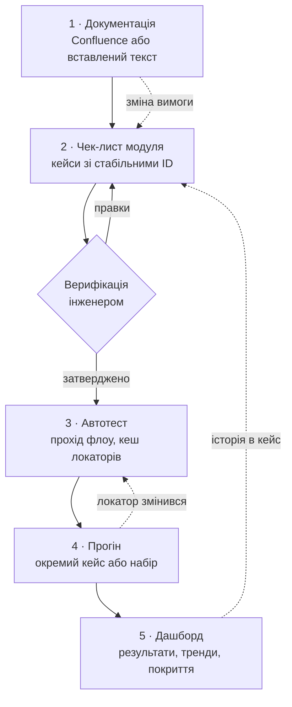

# Jules QA

Реєстр тест-кейсів з AI-генерацією і власним рушієм автотестів. Локальний, без хмари: вимоги з
Confluence перетворюються на чек-листи, інженер їх верифікує, затверджені кейси йдуть у TestRail
або лишаються тут, а частина з них стає автотестами, які виконує AI-агент із комп'ютерним зором.

Усе, що робить AI, спершу потрапляє в **чергу апрувів** — у реєстр і в зовнішні системи нічого не
йде без рішення людини.

---

## Цикл, який закриває Jules


```mermaid
flowchart TB
  C["1 · Документація<br/>Confluence або вставлений текст"] --> B["2 · Чек-лист модуля<br/>кейси зі стабільними ID"]
  B --> V{"Верифікація<br/>інженером"}
  V -->|правки| B
  V -->|затверджено| S["3 · Автотест<br/>прохід флоу, кеш локаторів"]
  S --> R["4 · Прогін<br/>окремий кейс або набір"]
  R --> D["5 · Дашборд<br/>результати, тренди, покриття"]
  D -.->|історія в кейс| B
  C -.->|зміна вимоги| B
  R -.->|локатор змінився| S
```

Два зворотні зв'язки роблять це циклом, а не конвеєром в один бік: результат прогону лягає в
історію кейса, а зміна вимоги показує, які кейси треба переписати.

| Рівень | Що робить | Де живе |
|--------|-----------|---------|
| **Реєстр** | кейси, секції, покриття, прогони, черга апрувів | SQLite `data/registry.db`, `src/registry/` |
| **Інтерфейс** | шість розділів: дашборд, реєстр, апруви, прогони, покриття, налаштування | React + Vite, `web/` |
| **Сервер** | REST + SSE, оркестрація, авторизація | Express, `src/server/` |
| **Рушій** | виконання кроків браузером під керуванням AI | Playwright + Midscene, `src/engine/` |
| **Скіли й інтеграції** | генерація кейсів, перевірка покриття, Confluence, TestRail | `src/registry/skills/`, `src/integrations/` |

---

## Швидкий старт

Потрібні **Node 22+** (реєстр працює на вбудованому `node:sqlite`) і Chromium для рушія.

```bash
cp .env.example .env         # відредагуйте під свою модель
npm install
npx playwright install chromium

npm run ui:build             # збірка інтерфейсу (один раз)
npm run registry:migrate     # наявні сценарії, набори й прогони → реєстр
npm run start                # http://localhost:3840
```

Перевірити, що цикл справді працює:

```bash
npm run registry:smoke       # 42 перевірки наскрізь: документ → кейс → прогін → дашборд
```

Docker: `docker compose up --build -d`. Базовий образ мусить мати Node 22+ — збірка це перевіряє
й падає з поясненням, якщо ні.

---

## Шість розділів інтерфейсу

| Розділ | Для чого |
|--------|----------|
| **Дашборд** | черга рішень, покриття вимог, частка автоматизації, pass rate, зведення за модулями, нестабільні кейси |
| **Реєстр** | дерево секцій, таблиця кейсів, деталі кейса з історією; фільтри й сортування живуть в адресі, тож посилання можна переслати |
| **Апруви** | усе, що запропонував AI: новий кейс, оновлення, масова правка, зміна локатора — з diff і поділом «цитата вимоги / домисел AI» |
| **Прогони** | ручні та автоматичні в одній історії; проходження чек-листа з клавіатури (`1` пройдено, `2` впало, `3` заблоковано, `4` пропущено) |
| **Покриття** | джерела вимог, матриця «блок → кейси», прогалини, запуск скілів |
| **Налаштування** | проєкт, доступ, стан інтеграцій по ролях, профілі мапінгу TestRail, журнал запусків скілів |

Гарячі клавіші: `/` — пошук, `j`/`k` — рух по рядках, `space` — вибір, `Esc` — закрити, `?` — довідка.

---

## Реєстр: з чого він складається

| Сутність | Суть |
|----------|------|
| **Проєкт** | префікс ID кейсів (`CYBER`), базовий URL, зв'язок із проєктом TestRail |
| **Секція** | дерево модулів і підкатегорій, як у TestRail |
| **Кейс** | стабільний ID `CYBER-REG-014`, чек-лист перевірок, тип (позитивний / негативний / нейтральний / безпековий / a11y / швидкодія), пріоритет, статус, теги, власник, версія |
| **Ревізія** | кожна зміна кейса з diff, автором і причиною; є відкат |
| **Джерело і блок** | документ вимог, розбитий на блоки з хешами — основа для «що змінилось у вимогах» |
| **Покриття** | зв'язок «блок ↔ кейс» із поділом на цитату і домисел AI |
| **Пропозиція** | черга апрувів: нічого не потрапляє в реєстр без рішення людини |
| **Вибірка** | статичний список або збережений фільтр — заміна старих «наборів» |
| **Прогін і результат** | ручний чи автоматичний прогін, статус по кожному кейсу, докази, дефект |

**ID кейса ніколи не змінюється** — ні при перейменуванні, ні при переміщенні між секціями.

### Масові операції

Головна рутина ручного QA — змінити термін у сотні кейсів. У реєстрі це одна операція:
пошук і заміна по заголовках, перевірках і кроках, з регексом і врахуванням регістру,
спершу `dryRun` із таблицею «було → стало» і кількістю входжень, потім застосування в одній
транзакції — і кнопка «Відкотити», бо кожна зміна пише ревізію.

Пошук у реєстрі — FTS5 із нормалізацією української та російської: «акти» знаходить «Акти» і «АКТИ».

---

## AI-скіли

| Скіл | Вхід | Вихід |
|------|------|-------|
| `write-cases` | блок вимог + секція + правила стилю | кейси в чергу апрувів, з поділом «цитата / домисел» |
| `validate-coverage` | блоки + наявні кейси | прогалини, дублі, кейси без перевірної умови, суперечності |
| `format-export` | затверджені кейси + профіль мапінгу | CSV / XML / payload для API з dry-run |

Правила генерації взяті з практики команди: один кейс — одна перевірка; ємний заголовок у стилі
чек-листа; обов'язково додаються негативні, нейтральні й безпекові перевірки, яких немає у вимозі,
і позначаються як `derived`; руйнівні дії заборонені. Після генератора працює критик, а потім —
детермінований санітайзер, який ріже тавтології, складені перевірки й дублі незалежно від моделі.

Один блок вимог = один запит до моделі, жорстка JSON-схема на виході, валідація й повтор при
невідповідності. Для тексту зір не потрібен, тож генерація може працювати на локальній моделі.

### Три ролі моделі

Jules використовує три окремі адреси: **виконання** (`MIDSCENE_MODEL_*`), **генерація**
(`PLANNER_MODEL_*`) і **критик** (`CRITIC_MODEL_*`). Якщо одна з них недоступна, впаде лише
відповідний крок — тому в «Налаштуваннях» є таблиця стану по ролях із адресою, моделлю й помилкою
(`GET /api/registry/integrations/health`). Це перше місце, куди варто дивитися, коли скіл відповідає
«модель недоступна».

---

## Інтеграції

### Confluence

Імпорт сторінки за URL (`CONFLUENCE_BASE_URL`, `CONFLUENCE_EMAIL`, `CONFLUENCE_API_TOKEN`) або
вставленим текстом. Власний парсер storage-HTML: заголовки стають межами блоків, таблиці
перетворюються на рядки «колонка: значення», списки — на рядки з тире, макроси відкидаються.
Кожен блок отримує хеш, тож повторний імпорт показує, що змінилось, і які кейси це зачіпає.

### TestRail

Формат уніфікований, тому окремий приклад експорту не потрібен.

- **Файлами** — працює одразу: CSV з BOM і CRLF (Excel не ламає кирилицю й не зліплює кроки) та XML
  із вкладеними секціями. Наш ID кейса кладеться в кастомне поле, тож round-trip надійний.
- **Через API** (`TESTRAIL_BASE_URL`, `TESTRAIL_USER`, `TESTRAIL_API_KEY`) — `push` створює відсутні
  секції, додає нові кейси й оновлює змінені (незмінені пропускаються за `syncHash`); `pull` знаходить
  наші кейси за ID, підхоплює `caseId` і показує розбіжності, а `scope=results` перетворює ран TestRail
  на прогін реєстру з історією по кейсах. Пакетні однакові значення йдуть через `update_cases`,
  ліміт 429 обробляється з backoff.
- **Дрейф** — список кейсів, змінених у нас після останньої синхронізації.

---

## Рушій автотестів

Кейс зі статусом `automation: automated` і прив'язаним YAML-сценарієм виконується рушієм:
Playwright як хост, Midscene як агент із комп'ютерним зором, кроки — природною мовою, без селекторів.

| Режим | Кеш локаторів | Виклики моделі |
|-------|---------------|----------------|
| `warm-up` | запис | на кожному кроці; AI досліджує інтерфейс |
| `regression` | лише читання | тільки при промаху кеша або самолікуванні |

- **Ключ кеша враховує URL**: `<назва>--<хеш8(цілі)>`. Той самий сценарій на іншому сайті більше не
  отримує чужі локатори. Старі артефакти читаються як fallback, кеш переноситься автоматично.
- **Self-heal** — до 3 спроб зі свіжим скриншотом; полікуваний крок позначається `healed` і впливає
  на `flakeScore` кейса.
- **`skipped`** — недосягнуті кроки записуються явно, тому `summary.total` стабільний між прогонами.
- **`modelCalls`** на кожному кроці — видно, чи справді регресія йшла без моделі.
- **HITL** — крок із префіксом `human:` ставить прогін на паузу й чекає оператора (працює і в CLI).
- **Секрети** — лише через vault і `{{secret:profile.field}}`; для сценаріїв із секретами трасування
  автоматично вимикається, щоб пароль не потрапив у `trace.zip`.

Результат автопрогону сам доходить до кейса: сервер стежить за прогонами рушія і пише статус у
елемент прогону реєстру (`POST /api/registry/runs/:id/sync-auto` — ручний запуск тієї ж синхронізації).

---

## Безпека

- `JULES_API_TOKEN` вмикає авторизацію для всього `/api/**` (Bearer або `?token=`); без нього сервер
  пише попередження при старті.
- `GET /api/llm/check` б'є лише по хостах з allowlist (адреси моделей з `.env` плюс localhost) —
  інакше підміна `llmBaseUrl` могла б витягнути ключ моделі.
- `data/storage-states/`, `data/auth-profiles/`, `data/registry.db*` — у `.gitignore`.
- Вміст сторінок і документів — це дані, а не інструкції для агента.

---

## Команди

```bash
npm run start              # сервер + інтерфейс
npm run ui:dev:web         # фронтенд у режимі розробки (проксі на :3840)
npm run registry:migrate   # міграція старих даних у реєстр
npm run registry:smoke     # наскрізна перевірка циклу по HTTP
npm run qa -- --scenario scenarios/<файл>.yaml --mode warm-up   # рушій із CLI
npm run test:fast          # unit + api (vitest)
npm run test:registry      # лише реєстр
npm run test:ui            # e2e інтерфейсу (Playwright)
npm run typecheck
```

API реєстру описаний у [`docs/registry-api.md`](docs/registry-api.md), межі шарів — у
[`docs/module-contracts.md`](docs/module-contracts.md).

---

## Структура

```
src/registry/       реєстр: БД, сховища, масові операції, дашборд, скіли
src/integrations/   Confluence, TestRail (CSV, XML, API)
src/server/         Express, маршрути реєстру, авторизація, оркестрація прогонів, мостик до рушія
src/engine/         Midscene, self-heal, HITL, гібридний runner
src/planning/       планувальник: мета → чекліст
src/security/       vault, профілі автентифікації, редакція логів
src/codegen/        транспіляція warm-up → Playwright spec
web/                інтерфейс (React + Vite)
scenarios/          YAML-сценарії рушія
data/               registry.db, runs/, settings.json, vault
docs/               контракти API і модулів
```

---

## Усунення несправностей

| Симптом | Причина / рішення |
|---------|-------------------|
| «Реєстр потребує Node 22+» | вбудований `node:sqlite` є з Node 22 (`--experimental-sqlite`) і без прапорця з Node 24 |
| Скіл каже «модель недоступна» | подивіться «Налаштування → Моделі за ролями»: у `.env` адреси `PLANNER_`/`CRITIC_` можуть вести на інший порт, ніж робочий |
| Генерація дає дивні кейси | перевірте, що блоки розбилися коректно (екран «Покриття»), і задайте приклади стилю в правилах скіла |
| Імпорт дав один величезний блок | вставлений текст не мав заголовків; передайте `format` або вставте HTML зі Confluence |
| Пошук не знаходить кирилицею | пошук нормалізує регістр сам; якщо порожньо — перевірте фільтр секції та «З підсекціями» |
| Регресія повільна | не було `warm-up` на цій цілі, або UI змінився: дивіться `modelCalls` у кроках |
| Прогін завис на `paused` | це пауза HITL — натисніть «Продовжити» у прогоні або Enter у терміналі |
